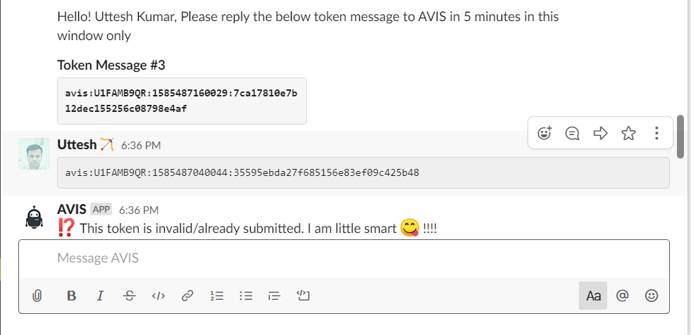
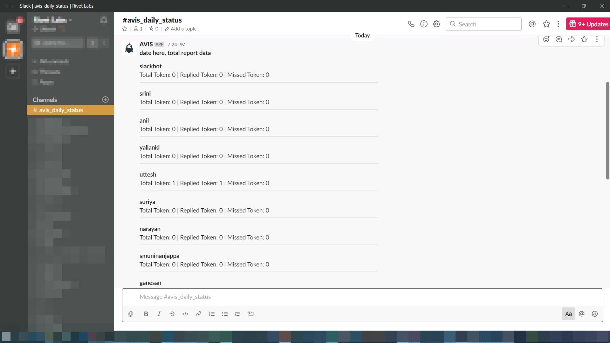

#  AVIS Bot beta

!!! Version ""
     This Slack bot app wrote in the 10 hours !! on 28th-29th March 2020 on lockdown days **#stayhomehackathon**

AVIS bot is an Open Source slack bot written on the **#stayhomehackathon**, its very simple bot which interacts with the slack user in an interval of time and generates a report on the interaction.

## Features

* Monitor the user activity and interaction
* Generate daily reports.

## How it works

1. AVIS Bot will send the user token on the regular/random interval.
2. The user needs to respond the token to the AVIS on the same chat window on the specific interval, default 5 minutes.
3. If the user response in the valid time interval, the bot will respond with the successfully received message.
4. If the user response after the valid response time, the bot will respond to the "late reply, token expired" message.
5. if the user trying to send the old token/invalid token. the bot will respond with the validation error message.
6. At the end of the day, the bot will send the report to the dedicated avis_daily_status channel with the report data.

### Bot activities
1. The bot will send token only in the working hours i.e. morning 9:30 to 6:30 evening.
2. The bot will be paused on the lunch break i.e. 1:00 to 2:00
3. The bot will be paused on the weekends.

AVIS bot interaction flows:

   1.Token send by the AVIS to user and notification

   2. Response to the AVIS bot with the token and bot response to a valid token.

      

   3. Bot response to the late reply of the token.

     

   4. Bot response to the invalid/already-submitted Token.
   
     

   5. Simple daily report to the avis_daily_status channel
   
     

## Demo

<iframe width="560" height="315" src="https://www.youtube.com/embed/doXpwsEyS00" frameborder="0" allow="accelerometer; autoplay; encrypted-media; gyroscope; picture-in-picture" allowfullscreen></iframe>

   
   

